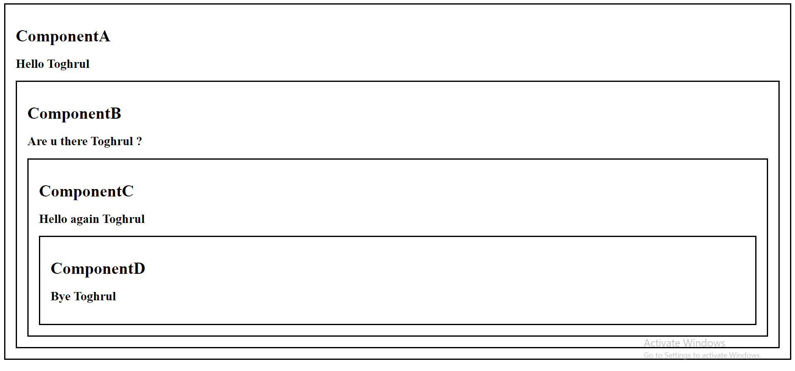

# useContext() Hook 

The useContext hook allows you to pass data down to nested components in your component tree without having to manually pass props through each level. It's a real time-saver, especially in larger applications where prop drilling can become cumbersome.

In our example, we start by creating a UserContext using the createContext function. This context will hold the user data that we want to share across components.

<strong>Inside ComponentA, we wrap ComponentB with a UserContext.Provider. This provider component accepts a value prop where we pass the user data.

Now, in ComponentB, we can access this user data without any prop drilling using the useContext hook.<strong/>

